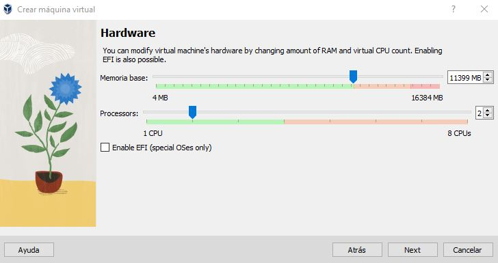

# Instalación de CentOS-7

Fecha: *Noviembre 25 de 2022*

Utilizaremos **Oracle Virtual Box** de el paso anterior para crear la máquina virtual de **CentOS.**

### Paso 1. Descargar el Sistema Operativo

Descargamos **CentOs.iso** en nuestro sistema operativo.

Enlace de la página [aquí](https://www.centos.org/download/)

- #### Seleccionaremos la opción x86_64 y a continuación usaremos cualquier enlace.

  

- #### Seleccionamos CentOs-7-x86_64-DVD y descargamos el más pesado.

## Paso 2. Instalación en Virtual Box

#### Abrimos Virtual Box y seleccionamos Nueva

#### Aparecerá una ventana y rellenaremos los datos.

Nombre: El nombre que aparecerá en el menú de VirtualBox para reconocer nuestra máquina Virtual.

Folder: La carpeta donde se almacenará la máquina virtual, podéis usar la de por defecto o poner una nueva.

ISO Image: Usaremos la flechita de la izquierda para buscar el archivo descargado en el paso anterior.

#### Aparecerán datos para crear la cuenta, aconsejamos usar datos que puedas recordar.

#### Ahora toca configurar el Hardware Virtual.

Añadiremos toda la barra verde en memoria y un par de procesadores a ser posible, todo dependerá de la potencia de vuestra máquina.

- **Añadiremos al menos 100GB de disco duro.**

**Finalmente Seleccionamos Terminar**

## Paso 3. Configuración de la Máquina Virtual

A veces, con algunos Sistemas operativos, debemos volver a indicarle el archivo descargado en el paso 1.

#### Seleccionamos nuestra máquina y pinchamos en configuración.

#### Seleccionamos nuestra máquina y pinchamos en configuración.

Iremos a **Almacenamiento**.

Seleccionamos En **Controlador IDE** el disco **Vacío**, le damos al disco y le damos a **Choose a disk file..** y buscamos nuestro archivo del paso 1 y aceptamos.

## Paso 4. Instalación del Sistema Operativo

## Ahora toca iniciar la máquina virtual

Seguimos al asistente de instalación, elegimos el idioma y seleccionamos disco.

#### Selecionamos el disco y le damos a Listo

#### Volvemos a la ventana anterior y le damos a Empezar instalación.

 

y finalmente Le daremos contraseña al ROOT y crearemos un usuario de ser necesario.  

**UTILICEN DATOS QUE PUEDAN RECORDAR**

## Nos pedirá reiniciar y listo.