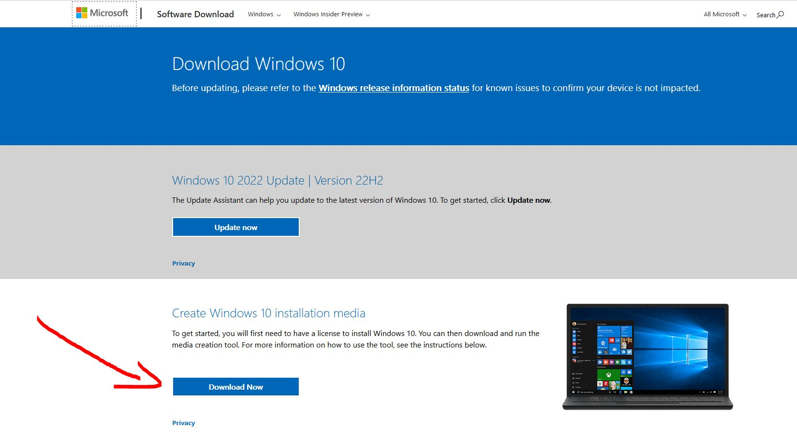
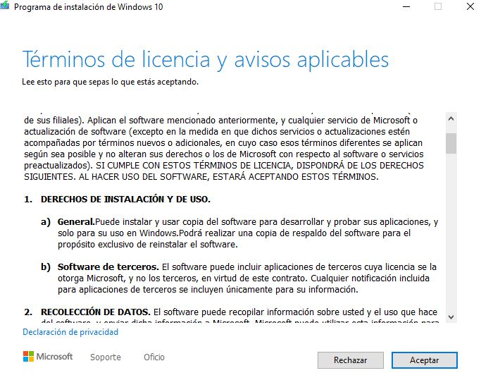
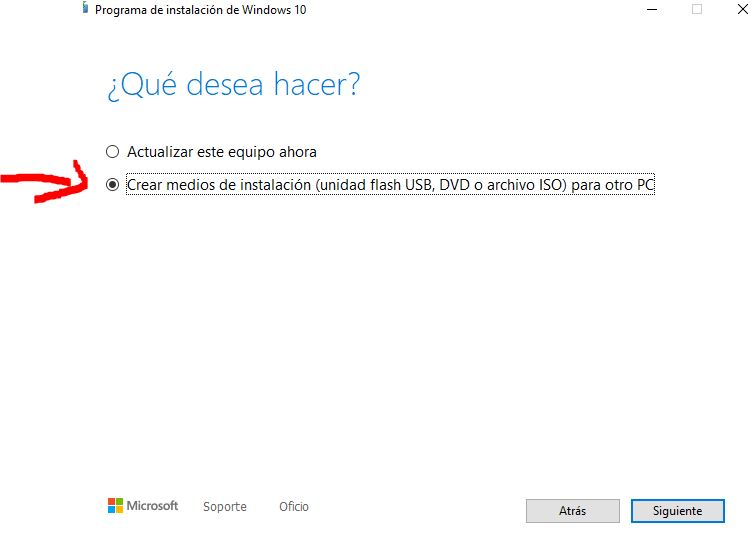
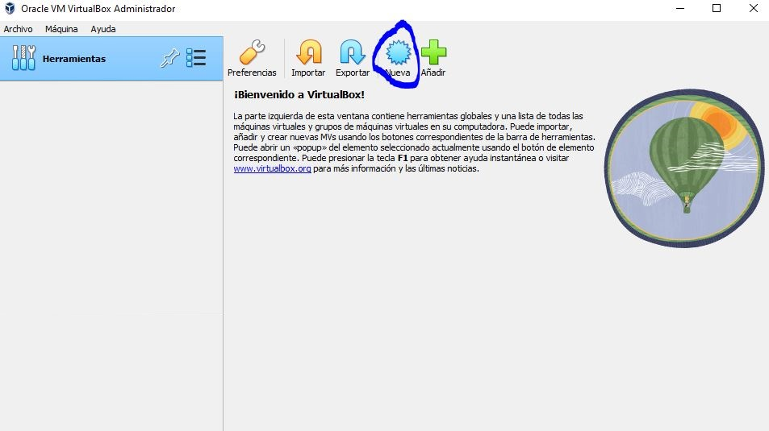
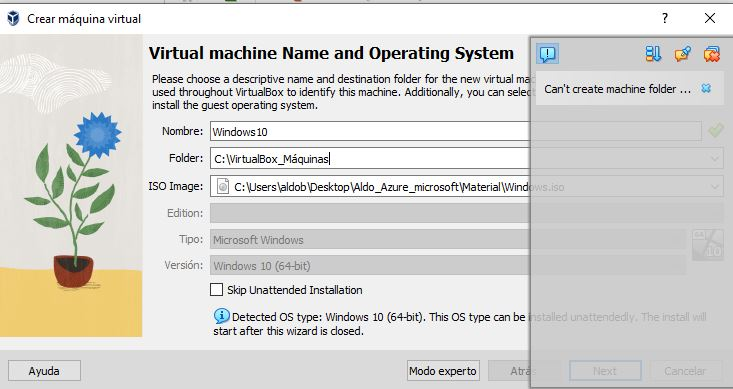
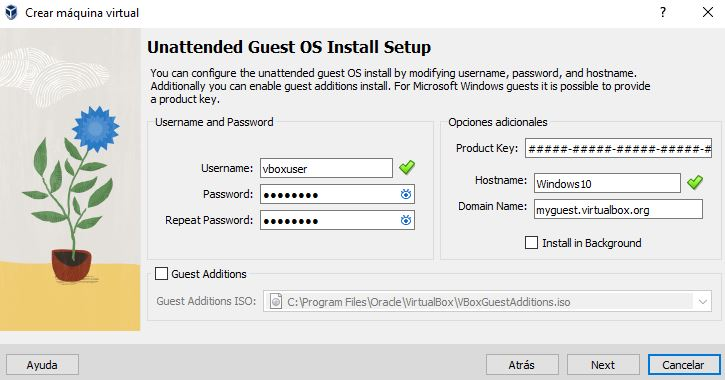
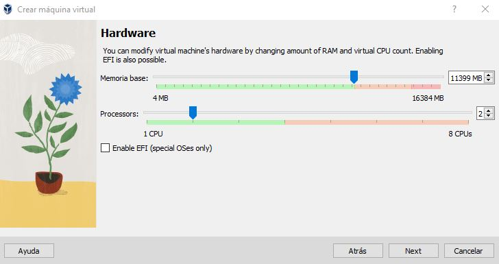
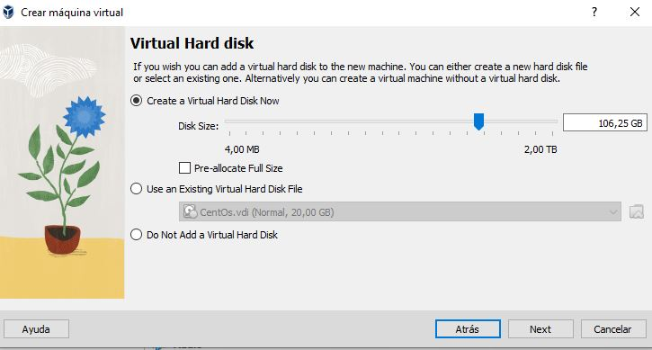
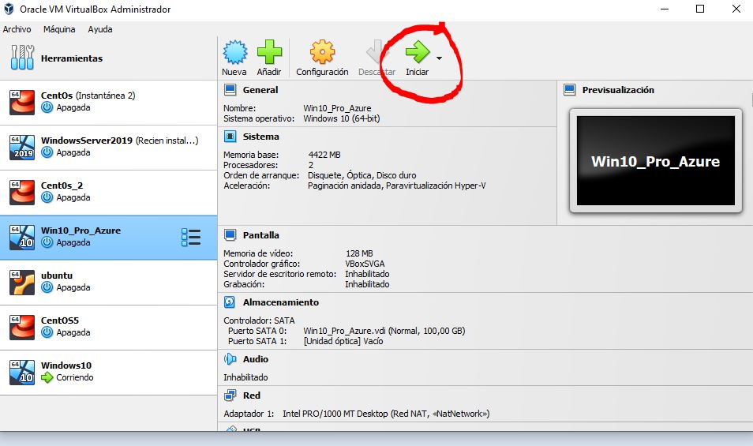

# Instalando Windows 10

Esta es mi experiencia instalando window 10 en virtual box.

Noviembre 24 de 2022

## Paso 1

Descargamos el fichero ISO de la herramienta 

``` MediaCreationTool22H2 ```

Descargada de este enlace: [pinchar aqui](https://www.microsoft.com/en-us/software-download/windows10)



Al iniciar el programa ```MediaCreationTool22H2```

Aparece el siguiente asistente y Aceptamos el acuerdo de licencia



Selecionamos el idioma.

Seleccionamos ```Create installation media (USB flash drive, DVD, or ISO file) for another PC```




Hasta aqui, la creación del fichero ISO y ya podremos utilizarlo en virtualBox para crear nuestra maquina virtual de Windows 10.


## Paso 2: Instalación en Virtual Box


#### Abrimos Virtual Box y seleccionamos Nueva





#### Aparecerá una ventana y rellenaremos los datos.

Nombre: El nombre que aparecerá en el menú de VirtualBox para reconocer nuestra máquina Virtual.

Folder: La carpeta donde se almacenará la máquina virtual, podéis usar la de por defecto o poner una nueva.

ISO Image: Usaremos la flechita de la izquierda para buscar el archivo descargado en el paso anterior.





#### Aparecerán datos para crear la cuenta, aconsejamos usar datos que puedas recordar.





#### Ahora toca configurar el Hardware Virtual.

Añadiremos toda la barra verde en memoria y un par de procesadores a ser posible, todo dependerá de la potencia de vuestra máquina.




- **Añadiremos al menos 100GB de disco duro.**





**Finalmente Seleccionamos Terminar**


## Paso 3. Instalación del Sistema Operativo


## Ahora toca iniciar la máquina virtual





Seguimos al asistente de instalación y elegimos las opciones que a cada uno le vengan bien, recomendamos Windows 10 Pro.


## Listo.