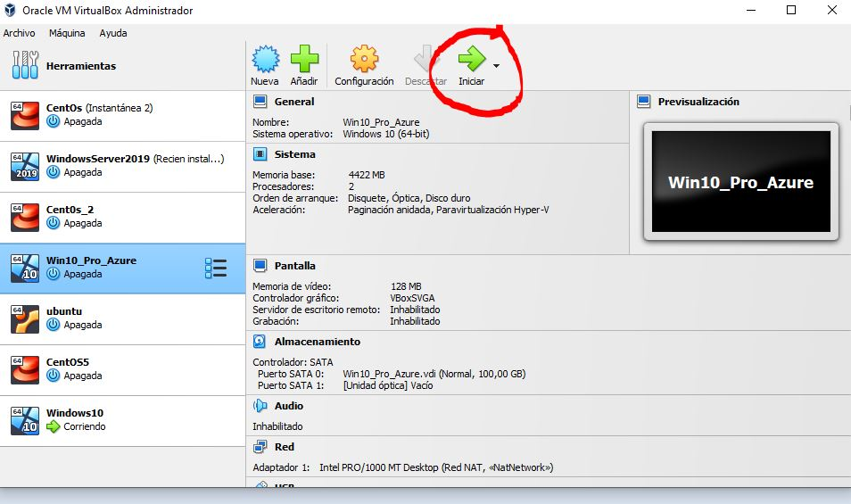

# Instalando Windows 10

Esta es mi experiencia instalando window 10 en virtual box.

Noviembre 24 de 2022

## Paso 1

Descargamos la ISO de este enlace: [pinchar aqui](https://www.microsoft.com/es-es/evalcenter/download-windows-server-2019)

## Paso 2: Instalación en Virtual Box

#### Abrimos Virtual Box y seleccionamos Nueva.

#### Aparecerá una ventana y rellenaremos los datos.

**Nombre**: El nombre que aparecerá en el menú de VirtualBox para reconocer nuestra máquina Virtual.

**Folder**: La carpeta donde se almacenará la máquina virtual, podéis usar la de por defecto o poner una nueva.

**ISO Image**: Usaremos la flechita de la izquierda para buscar el archivo descargado en el paso anterior.

**Skip Unattended Installation**: Estará activado.

#### Ahora toca configurar el Hardware Virtual.

Añadiremos toda la barra verde en memoria y un par de procesadores a ser posible, todo dependerá de la potencia de vuestra máquina.

- **Añadiremos al menos 100GB de disco duro.**

**Finalmente Seleccionamos Terminar**

## Paso 3. Instalación del Sistema Operativo

## Ahora toca iniciar la máquina virtual

Seguimos al asistente de instalación y elegimos idioma.

Elegimos Windows Sever 2019 Datacenter Evaluation (Dekstop Experience)

#### **Aceptamos los terminos de licencia**.

#### Elegimos Custom: Install WIndows Only

#### 

Seleccionamos el disco, y  clickamos  next.

## Continue con el asistente de instalacion

## Listo.