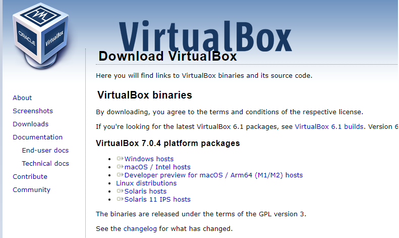

# Manejo de Máquinas Virtuales en Virtual Box

Fecha: *Noviembre 24 de 2022*

Utilizaremos **Oracle Virtual Box** Para crear máquinas virtuales, Windows10, CentOS, WindowsServer2019.

### Para comenzar

Descargamos **Oracle Virtual Box** en nuestro sistema operativo.

Enlace de la página [aquí](https://www.virtualbox.org/wiki/Downloads)

- #### Instale todo por defecto.

#### AHORA NOS DISPONDREMOS A INSTALAR SISTEMAS OPERATIVOS

Acceda a cada tutorial de instalación de sistemas operativos que se encuentra en este repositorio.